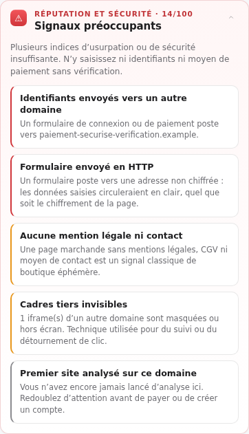
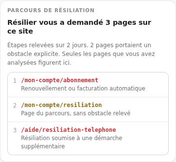
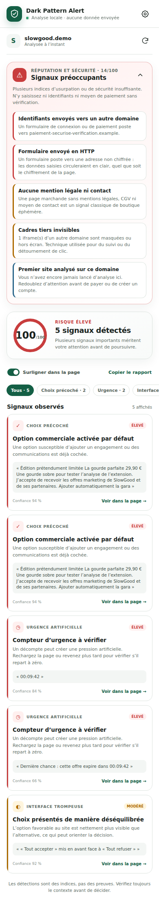
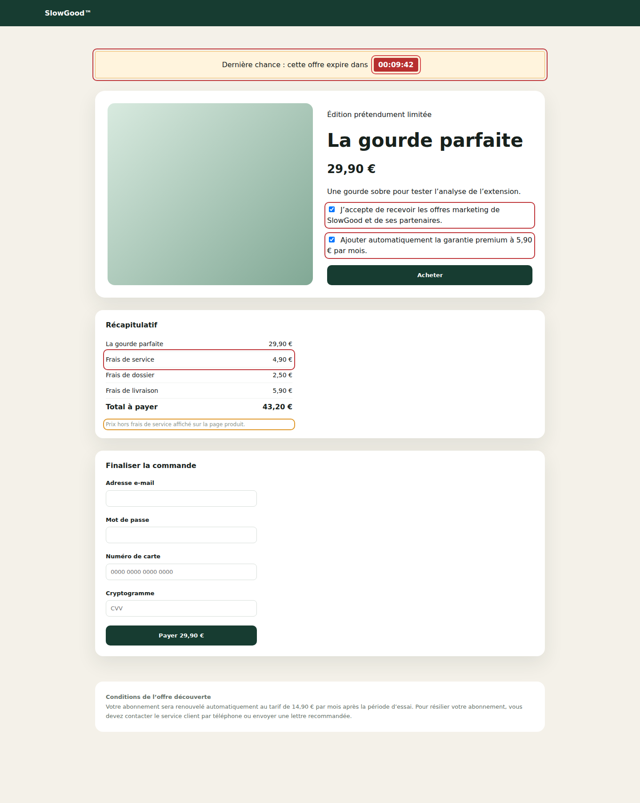

# Dark Pattern Alert

Extension Chrome (Manifest V3) qui répond à deux questions sur la page ouverte :

1. **Cette interface essaie-t-elle de m’influencer ?** — cases précochées, faux compteurs, boutons déséquilibrés, résiliation piégée.
2. **Puis-je faire confiance à ce site ?** — identité du domaine, chiffrement, formulaires, cadres tiers, mentions légales.

Tout est calculé **dans le navigateur, à la demande**. Aucune donnée n’est envoyée nulle part, aucun service de réputation externe n’est interrogé.

<table>
  <tr>
    <td width="50%"></td>
    <td width="50%"></td>
  </tr>
  <tr>
    <td align="center"><em>L’analyse ne démarre qu’à votre demande.</em></td>
    <td align="center"><em>Chaque signal est expliqué, jamais un simple verdict.</em></td>
  </tr>
</table>

## Installer en mode développeur

1. Ouvrir `chrome://extensions`.
2. Activer **Mode développeur**.
3. Cliquer sur **Charger l’extension non empaquetée**.
4. Choisir le dossier `dark-pattern-alert`.
5. Épingler l’extension, ouvrir un site, cliquer sur son icône : le panneau latéral s’ouvre.

Chrome 114 minimum (API `sidePanel`).

## Ce que l’extension repère

### 1. Interfaces trompeuses

| Catégorie | Exemples détectés |
| --- | --- |
| **Choix précoché** | case cochée par défaut, surtout sur une option commerciale (newsletter, assurance, abonnement) |
| **Urgence artificielle** | compte à rebours, « dernière chance », « offre limitée » dans un contexte marchand |
| **Interface trompeuse** | refus culpabilisant (« Non merci, je préfère payer plus cher »), bouton d’acceptation nettement plus visible que le refus |
| **Abonnement et résiliation** | renouvellement automatique, résiliation exigeant un appel ou un courrier, résiliation en ligne impossible |
| **Coûts ajoutés** | frais de service, de dossier ou de livraison qui gonflent le total après le prix annoncé ; mentions « hors frais », « + frais » ; part des frais dans le total |

Chaque détection porte une **sévérité**, un **niveau de confiance** et l’extrait de page qui l’a déclenchée. Le bouton « Voir dans la page » fait défiler jusqu’à l’élément et l’encadre.

Chaque signal peut être jugé : **« Oui »** ou **« Non, l’écarter »**. Un signal écarté disparaît des prochains rapports **sur ce site**, cesse de peser sur le score, et reste consultable derrière « Afficher ». Le jugement est réversible, tient compte des chiffres qui changent — un compteur ou un montant différent reste le même signal — et ne quitte jamais le navigateur : il n’alimente aucune base partagée.

#### Compteurs : la comparaison entre deux visites

Un décompte ne peut pas être qualifié de faux sur un seul instantané. L’extension relève donc sa valeur, localement, et la confronte à la visite suivante :

| Verdict | Ce qui a été observé |
| --- | --- |
| **Compteur réarmé** | il affiche plus de temps qu’à la visite précédente |
| **Compteur relancé après son terme** | il aurait dû atteindre zéro et tourne encore |
| **Compteur qui ne suit pas le temps réel** | l’écart avec le temps écoulé ne s’explique pas |
| **Compteur plus rapide que le temps réel** | il descend plus vite que l’horloge |
| **Compteur cohérent** | il a perdu exactement le temps écoulé — la sévérité **baisse**, et le score avec elle |

Le soupçon devient un constat daté, dans les deux sens : un compteur honnête est explicitement reconnu comme tel. Il faut au moins une minute entre deux analyses pour qu’un verdict soit rendu.

### 2. Réputation et sécurité du site

**Identité du domaine**

- connexion non chiffrée (HTTP), port inhabituel, identifiants intégrés à l’URL ;
- adresse IP nue au lieu d’un nom de domaine ;
- domaine en punycode (`xn--`), qui permet les attaques homographes ;
- **imitation de marque** : orthographe très proche d’une marque connue (`paypa1.com`), ou nom de marque placé dans un domaine tiers (`paypal.secure-checkout.net`) ;
- accumulation de mots d’appât (`verify`, `login`, `compte`…), extension à faible réputation, empilement de sous-domaines.

**Sécurité de la page**

- mot de passe ou champs de carte bancaire demandés hors HTTPS ;
- formulaire postant en HTTP ou vers un autre domaine, en particulier avec des identifiants ;
- contenu mixte actif (scripts ou feuilles de style en HTTP sur une page HTTPS) ;
- cadres tiers masqués, nombre de domaines tiers exécutant du code, scripts embarqués réellement obfusqués ;
- absence de mentions légales, CGV ou contact sur une page marchande.

Le score de confiance part de 100 et descend selon les signaux trouvés : **≥ 80** aucun signal d’alerte, **55–79** prudence recommandée, **< 55** signaux préoccupants.

#### Parcours de résiliation, sur plusieurs pages

<table>
  <tr>
    <td width="48%"></td>
    <td width="52%" valign="top">
      <p>Une résiliation qui s’étale sur cinq pages est un obstacle en soi, invisible page par page. L’extension retient les étapes de résiliation d’un même site et les récapitule.</p>
      <p>Une page compte comme étape si son adresse la désigne (<code>/resiliation</code>, <code>/unsubscribe</code>, <code>/cancel</code>…) ou si l’analyse y a relevé un obstacle. Une simple page d’abonnement ne suffit pas : sans quoi toute page « s’abonner » deviendrait une étape.</p>
      <p><strong>Rien n’est observé en arrière-plan.</strong> Seules figurent les pages que vous avez explicitement soumises à l’analyse — la carte le rappelle, car le compte est nécessairement partiel.</p>
    </td>
  </tr>
</table>

### 3. Éditeur et financement, sur les sites de presse

<table>
  <tr>
    <td width="46%"></td>
    <td width="54%" valign="top">
      <p>Sur les médias répertoriés (~70 titres français et internationaux), le panneau indique <strong>qui possède le titre</strong>, à quel groupe il appartient et <strong>comment il est financé</strong> : capitaux privés, service public, coopérative, association, fonds de dotation.</p>
      <p>Ces informations sont <strong>strictement factuelles</strong>. L’extension ne classe aucun média sur un axe politique et ne note pas sa ligne éditoriale : elle donne de quoi se faire soi-même une opinion. La carte n’entre dans aucun score.</p>
    </td>
  </tr>
</table>

Les données sont un instantané daté, embarqué dans `media-ownership.js`. L’actionnariat des médias change souvent : la carte affiche sa date d’arrêt et invite à vérifier.

## Le rapport

<table>
  <tr>
    <td width="58%"></td>
    <td width="42%" valign="top">
      <p>Le panneau ouvre sur la <strong>confiance accordée au site</strong>, puis liste les procédés trompeurs de la page.</p>
      <p>Les signaux se filtrent par catégorie, se surlignent dans la page, et le rapport entier se copie en texte brut — pratique pour un signalement ou une capture d’historique.</p>
    </td>
  </tr>
</table>

Les éléments signalés sont encadrés directement dans la page :



## Vie privée

<table>
  <tr>
    <td width="46%"></td>
    <td width="54%" valign="top">
      <p>L’extension demande <code>activeTab</code>, <code>scripting</code>, <code>sidePanel</code> et <code>storage</code> — rien de plus. Elle n’observe pas la navigation en arrière-plan et n’ouvre aucune connexion réseau.</p>
      <p><strong>Mémoriser les domaines analysés</strong> conserve au plus 500 noms de domaine sur lesquels une analyse a été explicitement lancée, uniquement pour signaler une première visite. Ni URL complète, ni horodatage, ni contenu de page. Désactivable avant toute analyse, effaçable d’un clic.</p>
      <p><strong>Comparer les compteurs</strong> conserve, pour au plus 200 pages portant un décompte, l’adresse sans paramètres, la valeur relevée et sa date. C’est ce qui permet de dire « ce compteur s’est réarmé » plutôt que « ce compteur est peut-être faux ». Même bouton d’effacement.</p>
      <p><strong>Tenir compte de mes retours</strong> conserve, pour au plus 300 sites, les signaux que vous avez confirmés ou écartés — sous forme d’empreinte, sans contenu de page. Même bouton d’effacement.</p>
      <p><strong>Suivre les parcours de résiliation</strong> conserve, pour au plus 100 sites et 30 étapes chacun, le chemin des pages de résiliation analysées et les obstacles qui y ont été relevés. Même bouton d’effacement.</p>
    </td>
  </tr>
</table>

Détail complet dans [`PRIVACY.md`](PRIVACY.md).

## Page de démonstration

`demo/index.html` rassemble volontairement des cases précochées, un compteur d’urgence, un récapitulatif qui ajoute 13,30 € de frais à un prix annoncé de 29,90 €, une résiliation par téléphone, un formulaire de paiement envoyé en HTTP vers un domaine tiers et un cadre de suivi masqué.

Depuis le dossier **parent** du projet :

```sh
python3 -m http.server 8080
```

Puis ouvrir `http://localhost:8080/dark-pattern-alert/demo/` et lancer l’analyse.


## Développement

```sh
npm test                 # les trois suites de règles
npm run capture          # régénère les captures de docs/ en thème clair
npm run capture:dark     # les mêmes en thème sombre, suffixées -dark
npm run capture:all      # les deux jeux d'un coup
npm run capture:system-chrome   # thème clair, avec un Chrome déjà installé
```

Le thème se choisit aussi par `--scheme=light|dark|both` ou par `DPA_SCHEME`. Les captures sombres portent un suffixe `-dark` et ne remplacent jamais les claires, celles auxquelles ce README renvoie. La page de démonstration n'ayant pas d'habillage sombre, elle n'est capturée qu'une fois.

| Fichier | Rôle |
| --- | --- |
| `background.js` | ouvre le panneau latéral au clic sur l’icône |
| `sidepanel.html` / `.js` / `.css` | interface, orchestration de l’analyse, rendu du rapport |
| `content-scanner.js` | applique les règles de dark patterns dans la page |
| `content-overlay.css` | encadre les éléments signalés |
| `site-probe.js` | relève les faits de sécurité observables, sans les interpréter |
| `reputation-rules.js` | calcule le score de confiance ; logique pure, testable hors navigateur |
| `media-ownership.js` | table d’actionnariat et de financement des médias, et sa recherche par domaine |
| `detector-rules.js` | source unique des expressions de détection, lue par le scanner et vérifiée par les tests |

Les scripts de `scripts/` ne sont jamais embarqués dans l'extension : ils produisent les captures, les icônes, les visuels de la fiche et l'archive.

Séparer la collecte (`site-probe.js`) de l’évaluation (`reputation-rules.js`) permet de tester tout le raisonnement sous Node, sans navigateur.

## Publication

Tout le nécessaire pour le Chrome Web Store est dans [`store/`](store/) :

- [`store/LISTING.md`](store/LISTING.md) — le texte de chaque champ, prêt à coller, avec son compte de caractères, les justifications de permission et les déclarations de confidentialité ;
- [`store/PUBLISHING.md`](store/PUBLISHING.md) — la marche à suivre, ce qui bloque encore, et les motifs de rejet qui guettent ce projet en particulier ;
- `store/assets/` — les cinq captures 1280 × 800, la tuile 440 × 280 et la bannière 1440 × 560.

```sh
npm run package        # archive à téléverser, fichiers exécutés uniquement
npm run store:assets   # visuels de la fiche
npm run icons          # icônes 16/32/48/128
```

`npm run package` refuse de produire l'archive si le résumé dépasse 132 caractères, si le nom dépasse 75, ou si une taille d'icône manque au manifeste.

## Limites assumées

Les résultats sont des **indices explicables, pas des preuves**.

- Un compteur ne peut pas être qualifié de faux à partir d’un seul instantané : la première analyse invite à vérifier, la suivante tranche. La comparaison suppose que le compteur garde la même identité entre deux visites ; une page qui régénère ses classes à chaque chargement échappe au rapprochement.
- Les frais sont lus dans le récapitulatif affiché : sur un tunnel où ils n’apparaissent qu’à l’étape suivante, l’extension ne peut rien voir avant d’y arriver. Un horaire de rendez-vous ou une date limite ne sont pas comptés comme des décomptes.
- Les contenus rendus dans des iframes ou des composants fermés échappent à l’analyse.
- Sans base de signalements ni WHOIS, l’analyse de réputation ignore l’âge du domaine et les campagnes d’hameçonnage en cours. **Un score de 100 signifie « rien d’anormal détectable localement », pas « site vérifié ».**
- La table des médias est un instantané embarqué : un rachat récent n’y figure pas, et un titre absent de la liste n’affiche aucune carte. Elle décrit l’actionnariat, jamais l’indépendance réelle d’une rédaction.
- La liste de marques est restreinte et le domaine enregistré est extrait avec une table de suffixes abrégée : des imitations passent, et un domaine légitime portant un nom de marque (filiale, revendeur) peut être signalé à tort.

## Prochaines étapes produit

- comparer le comportement d’un compteur entre deux visites ;
- détecter les coûts ajoutés au dernier moment ;
- analyser les parcours de résiliation sur plusieurs pages ;
- permettre de confirmer ou d’infirmer un signal pour affiner les règles localement ;
- préparer la fiche Chrome Web Store et compléter la politique de confidentialité avec les coordonnées de l’éditeur.
